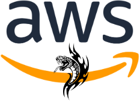
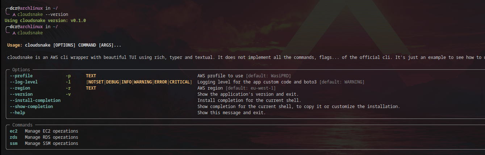
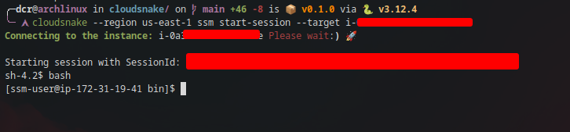
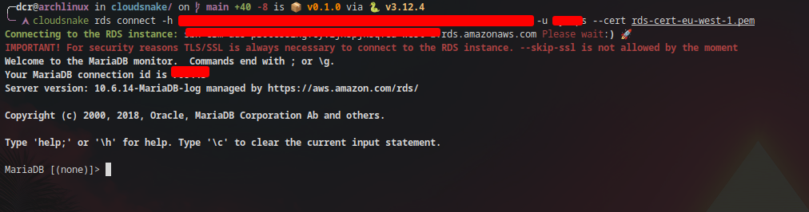

> [!WARNING]
> There is no "stable" version published on pypip yet. This tool is under development.


<p align="center" >
    
    <h3 align="center">cloudsnake 🐍</h3>
    <p align="center">Wrapping some awscli commands with beautiful TUI</p>
    <p align="center">Build with ❤ in Python</p>
</p>

<!-- START doctoc generated TOC please keep comment here to allow auto update -->
<!-- DON'T EDIT THIS SECTION, INSTEAD RE-RUN doctoc TO UPDATE -->
**Table of Contents**  *generated with [DocToc](https://github.com/thlorenz/doctoc)*

- [Why cloudsnake](#why-cloudsnake)
- [Badges](#badges)
- [Available implementations](#available-implementations)
- [Examples](#examples)
  - [Connect to the EC2 instance using SSM](#connect-to-the-ec2-instance-using-ssm)
    - [Example](#example)
  - [Connect to the RDS instance using IAM authentication db token](#connect-to-the-rds-instance-using-iam-authentication-db-token)
    - [Download the cert](#download-the-cert)
    - [Connect to the instance](#connect-to-the-instance)
    - [Example](#example-1)
- [Installation](#installation)
  - [Using pip](#using-pip)
  - [Using pipx with virtualenv (recommended)](#using-pipx-with-virtualenv-recommended)
  - [Local install](#local-install)
- [Uninstall](#uninstall)
  - [Using pip](#using-pip-1)
  - [Using pipx](#using-pipx)
- [Local development](#local-development)
  - [Local run with poetry](#local-run-with-poetry)
  - [Run & install pre-commit](#run--install-pre-commit)
  - [Testing](#testing)
- [TO DO](#to-do)
- [Improvements](#improvements)
  - [Positional flags](#positional-flags)
    - [Actually](#actually)
    - [Wants](#wants)
- [TOP LINKS](#top-links)
- [Poetry commands](#poetry-commands)
- [Cloudsnake commands](#cloudsnake-commands)
- [License](#license)

<!-- END doctoc generated TOC please keep comment here to allow auto update -->



# Why cloudsnake

The main intention of this tool is to continue improving my python skills, get to know the AWS [boto3](https://aws.amazon.com/es/sdk-for-python/) SDK better, and learn how to create a CLI using [typer](https://typer.tiangolo.com/), [rich](https://github.com/Textualize/rich), and [textual](https://textual.textualize.io/). The tool tries to implement some commands from the official AWS cli ([aws cli](https://github.com/aws/aws-cli)), adding my own logic and with highlights (pretty print json output/table with typer/rich).

> [!IMPORTANT]
> Do not try to use part of this code in a productive app as it is currently untested. (visit [#TO DO](https://github.com/containerscrew/cloudsnake?tab=readme-ov-file#to-do) section). I also don't know if this is the best way to use any of the tools that the application uses (boto3, typer, rich...), that is why any PR is welcome, it will be appreciated so I can continue improving my skills.

> [!IMPORTANT]
> In the end, the purpose of this tool is also to be able to facilitate the day to day, creating tools that help me to operate the platform. For example, to quickly connect to EC2, RDS...etc.

# Badges

|         |                                                                                                                                                                                                                                                                                                                                                         |
|---------|---------------------------------------------------------------------------------------------------------------------------------------------------------------------------------------------------------------------------------------------------------------------------------------------------------------------------------------------------------|
| Code    |                                                                                                                                                                                                                                                                   |
| CI/CD   | [](https://github.com/ofek/hatch-showcase/actions/workflows/test.yml) [](https://github.com/containerscrew/cloudsnake/actions/workflows/build.yml)                        |
| Package | [](https://www.python.org)[](https://pypi.org/project/hatch-showcase/)  |
| Meta    | [](https://github.com/pre-commit/pre-commit) [](https://spdx.org/licenses/)                                                                                             |
| Linter  | [](https://github.com/astral-sh/ruff)                                                                                                                                                                                            |


# Available implementations

* Connect to EC2 instances using SSM. You can pass the instance id (`--target`) or use the interactive menu (`--with-instance-selector`)

* Connect to the RDS instances using IAM db authentication.

> See examples in the next section

# Examples

For the examples, you need to be authenticated to AWS account using your local credentials.

In your terminal, set the corresponding `AWS_PROFILE=MyProfile` if not using the default. (`~/.aws/credentials`)

## Connect to the EC2 instance using SSM

```shell
cloudsnake ssm start-session --with-instance-selector # will print all your instances in a terminal menu
cloudsnake ssm start-session --target i-XXXXXX  # connect to the instance specifying the target id
```

### Example



## Connect to the RDS instance using IAM authentication db token

Please follow [this instructions](./docs/rds.md) to setup your RDS IAM authentication.

### Download the cert

By default, `cloudsnake` forces to use TLS/SSL connections.

```shell
cloudsnake rds download-cert --save-path /tmp
```

Other region:

```shell
cloudsnake --region us-east-1 download-cert --save-path /tmp
```

### Connect to the instance

Example for the region `eu-west-1`:

```shell
cloudsnake rds connect -h XXXXX.XXXXXX.eu-west-1.rds.amazonaws.com -u ADMIN --cert /tmp/rds-cert-eu-west-1.pem
```

### Example



# Installation

## Using pip

```console
pip3 install cloudsnake
```
> [!WARNING]
> Probably your system will not allow this installation method due to a broken system package.

<details>
<summary>Example error</summary>
<br>
Error:
<br><br>
<pre>
error: externally-managed-environment

× This environment is externally managed
╰─> To install Python packages system-wide, try 'pacman -S
    python-xyz', where xyz is the package you are trying to
    install.

    If you wish to install a non-Arch-packaged Python package,
    create a virtual environment using 'python -m venv path/to/venv'.
    Then use path/to/venv/bin/python and path/to/venv/bin/pip.

    If you wish to install a non-Arch packaged Python application,
    it may be easiest to use 'pipx install xyz', which will manage a
    virtual environment for you. Make sure you have python-pipx
    installed via pacman.

note: If you believe this is a mistake, please contact your Python installation or OS distribution provider. You can override this, at the risk of breaking your Python installation or OS, by passing --break-system-packages.
hint: See PEP 668 for the detailed specification.
</pre>
</details>

## Using pipx with virtualenv (recommended)

Install `pipx` with your system package manager (`apt`, `dnf`, `pacman`...).

```console
pipx install cloudsnake
```

## Local install

```console
git clone https://github.com/containerscrew/cloudsnake.git
cd cloudsnake
make pipx-local-install
```

# Uninstall

## Using pip

```console
pip3 uninstall cloudsnake
```

## Using pipx

```console
pipx uninstall cloudsnake
```

# Local development

## Local run with poetry

```console
git clone https://github.com/containerscrew/cloudsnake.git
cd cloudsnake
make update
make run
```

## Run & install pre-commit

```console
make pre-commit-install
make run-pre-commit
```

## Testing

```shell
git clone https://github.com/containerscrew/cloudsnake.git
cd cloudsnake
make run-tests
```

# TO DO

* Documentation with docstrings
* Add more tests with pytest and boto3 mock
* Remove @classmethod
* Ruff linter
* Cliff: changelog
* Pipelines with github actions. Automatic publish new version to `pypip`
* Other...

# Improvements

## Positional flags

### Actually

```shell
cloudsnake --log-level debug --region us-east-1 --profile default ec2 describe-instance
```

### Wants

```shell
cloudsnake ec2 describe-instances --log-level debug --region us-east-1 --profile default --other-specific-flags-for-this-subdommand
```

# TOP LINKS

[`links.md`](./docs/links.md)

# Poetry commands

[`poetry.md`](./docs/poetry.md)

# Cloudsnake commands

```shell
cloudsnake --help
cloudsnake ec2 describe-instances --filters "Name=instance-state-name,Values=running" --query 'Reservations[*].Instances[*].{Instance:InstanceId,VpcId:VpcId,AZ:Placement.AvailabilityZone,Name:Tags[?Key==`Name`]|[0].Value}' --output json
cloudsnake ec2 describe-instances --filters "Name=instance-state-name,Values=running" --output json
cloudsnake ec2 describe-instances --filters "Name=instance-state-name,Values=running" --query 'Reservations[*].Instances[*].{InstanceName:Tags[?Key==`Name`]|[0].Value}' --output json
cloudsnake ec2 describe-instances  --filters "Name=instance-state-name,Values=running" --query 'Reservations[*].Instances[*].Tags[?Key==`Name`].Value[][]'
cloudsnake rds describe-db-instances --query 'DBInstances[*].DBInstanceIdentifier'
cloudsnake ssm start-session --with-instance-selector
cloudsnake ssm start-session --target i-xxxxxxx
```

# License

`cloudsnake` is distributed under the terms of the [MIT](https://spdx.org/licenses/MIT.html) license.
