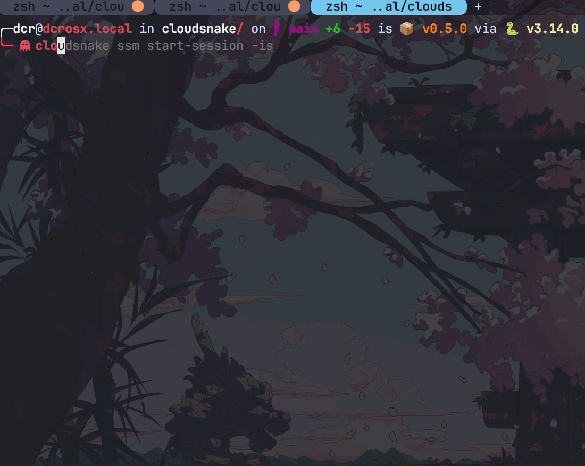

<p align="center" >
    <h3 align="center">cloudsnake 🐍</h3>
    <p align="center">Wrapping some useful AWS cli commands to operate AWS like EC2 SSM instance connection or RDS connection using IAM authentication</p>
</p>

---



---

<p align="center" >
    
    
    
    
    
    
    
    
    
    
    
</p>

---

# Available implementations

* Connect to EC2 instances using SSM. You can pass the instance id (`--target`) or use the interactive menu (`--with-instance-selector`)
* (In progress) Connect to RDS instances using IAM authentication db token

# Examples

For the examples, you need to be authenticated to AWS account using your local credentials.

In your terminal, set the corresponding `AWS_PROFILE=MyProfile` if not using the default. (`~/.aws/credentials`)

## Connect to the EC2 instance using SSM

```shell
cloudsnake ssm start-session -is # will print all your instances in a terminal menu
cloudsnake ssm start-session --target i-XXXXXX  # connect to the instance specifying the target id
```
---

# Installation

## Using pip

```console
pip3 install cloudsnake
```

> [!WARNING]
> Probably your system will not allow this installation method due to a broken system package.

<details>
<summary>Example error</summary>
<br>
Error:
<br><br>
<pre>
error: externally-managed-environment

× This environment is externally managed
╰─> To install Python packages system-wide, try 'pacman -S
    python-xyz', where xyz is the package you are trying to
    install.

    If you wish to install a non-Arch-packaged Python package,
    create a virtual environment using 'python -m venv path/to/venv'.
    Then use path/to/venv/bin/python and path/to/venv/bin/pip.

    If you wish to install a non-Arch packaged Python application,
    it may be easiest to use 'pipx install xyz', which will manage a
    virtual environment for you. Make sure you have python-pipx
    installed via pacman.

note: If you believe this is a mistake, please contact your Python installation or OS distribution provider. You can override this, at the risk of breaking your Python installation or OS, by passing --break-system-packages.
hint: See PEP 668 for the detailed specification.
</pre>
</details>

## Using pipx (Recommended)

Install `pipx` with your system package manager (`apt`, `dnf`, `pacman`...).

```console
pipx install cloudsnake
```

# Uninstall

```console
pip3 uninstall cloudsnake
# or
pipx uninstall cloudsnake
```

# License

`cloudsnake` is distributed under the terms of the [GPL3](https://spdx.org/licenses/GPL-3.0-or-later.html) license.
