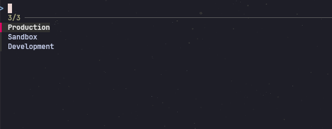
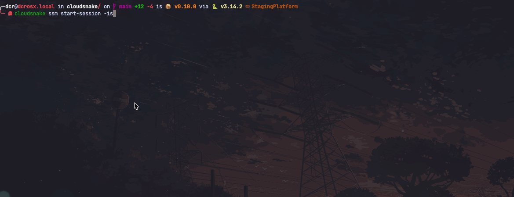
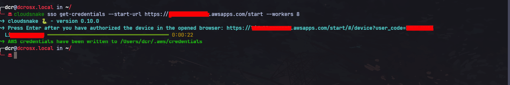
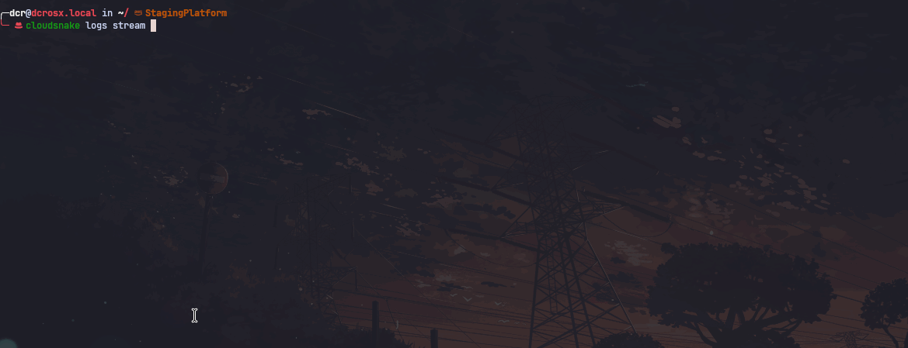

<p align="center" >
    <h3 align="center">cloudsnake 🐍</h3>
    <p align="center">Wrapping some useful AWS cli commands to operate some services like EC2, SSO and more</p>
</p>

---

<p align="center" >
    
    
    
    
    
    
    
    
    
    
    
    
</p>

---

In your terminal, set the corresponding `AWS_PROFILE=MyProfile` if not using the default. (`~/.aws/credentials`). Copy [this helper function](./aws-profile.sh) called `aws-profile` into your favourite shell (`.bashrc`, `.zshrc`, `~/.config/fish/function`) to easily switch between AWS profiles. In case of using `fish` shell, use [this other function](./aws-profile.fish).

<br><br>
<p align="center">
    
<h3 align="center">aws-profile</h3>
</p>

---
<br><br>
<p align="center">
    
<h3 align="center">SSM session</h3>
</p>

Install the [REQUIRED plugin](https://docs.aws.amazon.com/systems-manager/latest/userguide/session-manager-working-with-install-plugin.html) to use SSM sessions.


```shell
cloudsnake ssm start-session -is # will print all your instances in a terminal menu
cloudsnake ssm start-session --target i-XXXXXX  # connect to the instance specifying the target id
```

---

<br><br>
<p align="center">
    
<h3 align="center">SSM parameter</h3>
</p>

```shell
cloudsnake ssm get-parameter # default region eu-west-1
cloudsnake --region us-east-1 ssm get-parameters # specify region
```
---

<br><br>
<p align="center">
    
<h3 align="center">SSO get-credentials</h3>
</p>

```shell
cloudsnake --region eu-west-1 sso get-credentials --start-url https://myapp.awsapps.com/start
```

> [!NOTE]
> This command will open your default browser. You will need to approve manually the authentication.
> More use cases and examples for `cloudsnake sso get-credentials` can be found in [`docs/sso-get-credentials.md`](./docs/sso-get-credentials.md).

---

<br><br>
<p align="center">
    
<h3 align="center">Cloudwatch log stream</h3>
</p>

```shell
# Opens an interactive menu to select the log group
cloudsnake logs stream

# Streams logs from 1 day ago with a filter pattern "deleting"
cloudsnake logs stream --since 1d --log-group /aws/lambda/my-function-name --filter-pattern "deleting"

# Streams (tails) logs starting from the moment you execute the command
cloudsnake logs stream --log-group /aws/lambda/my-function-name

# Streams logs from a specific window (between 30 mins ago and 1 min ago)
cloudsnake logs stream --since 30m --end 1m --log-group /aws/lambda/my-function-name
```

---

<br><br>
<p align="center">
    
<h3 align="center">CloudTrail events</h3>
</p>

```shell
# Monitor recent activity from the last 15 minutes (default)
cloudsnake trail events

# Look back 10 minutes
cloudsnake trail events --since 10m

# Look back 1 hour
cloudsnake trail events --since 1h

# Look back 1 day
cloudsnake trail events --since 1d

# Fetch events once and exit (no follow)
cloudsnake trail events --since 1h --once

# Watch only write (mutating) API calls
cloudsnake trail events --write-only --since 1h

# Watch only read-only API calls
cloudsnake trail events --read-only

# Filter by a specific AWS action
cloudsnake trail events --event DeleteTable
cloudsnake trail events --event TerminateInstances

# Filter events by a specific user
cloudsnake trail events --user john.doe

# Filter events by a specific resource
cloudsnake trail events --resource i-0123456789abcdef

# Search for an error message across all JSON bodies
cloudsnake trail events --search AccessDenied --since 6h

# Search for an IP address
cloudsnake trail events --search 203.0.113.15 --since 1d

# Dot-path structured search
cloudsnake trail events --search requestParameters.instanceId=i-0123456789abcdef
cloudsnake trail events --search userIdentity.type=AssumedRole

# Combine server-side filtering with client-side search (advanced)
cloudsnake trail events --event StopInstances --search Unauthorized --since 12h

# Full JSON output
cloudsnake trail events --output json

# NDJSON output (pipe-friendly)
cloudsnake trail events --output ndjson
cloudsnake trail events --output ndjson | jq '.EventName'

# Inline jq filtering
cloudsnake trail events --jq '.userIdentity.type == "AssumedRole"'
cloudsnake trail events --output ndjson --jq '.EventName'

# Scriptable examples

# Count API calls by type in the last hour
cloudsnake trail events --output ndjson --since 10m \
  | jq -r '.EventName' | sort | uniq -c

# Find delete or terminate actions in the last 24 hours
cloudsnake trail events --output ndjson --since 24h \
  | jq 'select(.EventName | test("Delete|Terminate"))'
```

# Installation

## Using pipx (Recommended)

Install `pipx` with your system package manager (`apt`, `dnf`, `pacman`...).

```console
pipx install cloudsnake
```

## Using pip

```console
pip3 install cloudsnake
```

> [!WARNING]
> Probably your system will not allow this installation method due to a broken system package.

<details>
<summary>Example error</summary>
<br>
Error:
<br><br>
<pre>
error: externally-managed-environment

× This environment is externally managed
╰─> To install Python packages system-wide, try 'pacman -S
python-xyz', where xyz is the package you are trying to
install.

    If you wish to install a non-Arch-packaged Python package,
    create a virtual environment using 'python -m venv path/to/venv'.
    Then use path/to/venv/bin/python and path/to/venv/bin/pip.

    If you wish to install a non-Arch packaged Python application,
    it may be easiest to use 'pipx install xyz', which will manage a
    virtual environment for you. Make sure you have python-pipx
    installed via pacman.

note: If you believe this is a mistake, please contact your Python installation or OS distribution provider. You can override this, at the risk of breaking your Python installation or OS, by passing --break-system-packages.
hint: See PEP 668 for the detailed specification.

</pre>
</details>

# Upgrade

```bash
pipx upgrade cloudsnake
```

# Uninstall

```bash
pipx uninstall cloudsnake
# or
pip3 uninstall cloudsnake
```

## Debug AWS SDK API calls

```shell
cloudsnake --log-level debug command subcommand [options]
```

# License

`cloudsnake` is distributed under the terms of the [GPL3](https://spdx.org/licenses/GPL-3.0-or-later.html) license.
